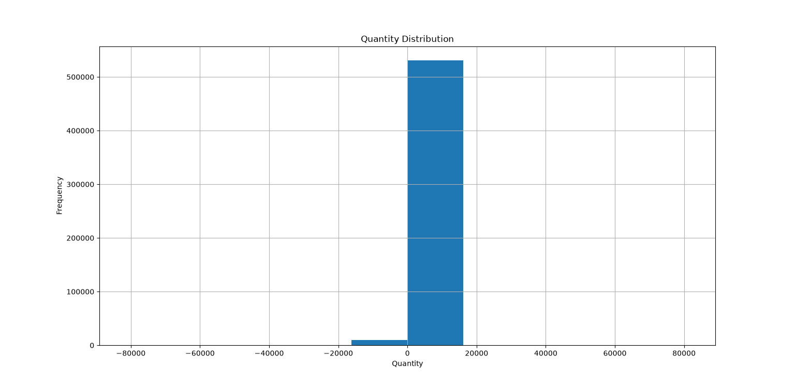
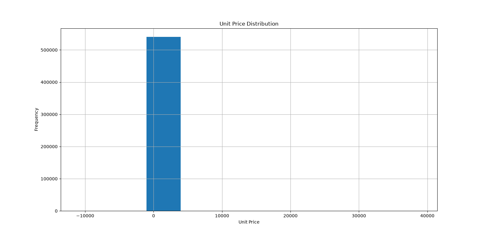
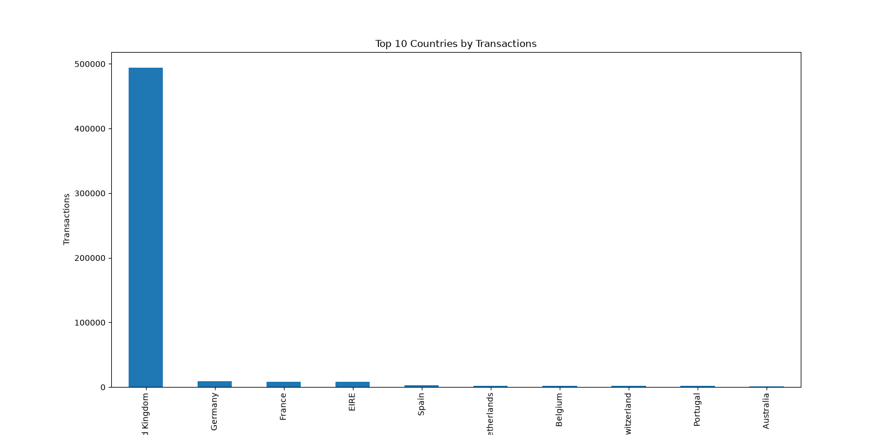

# E-Commerce Sales Analysis

## Problem Statement
Analyze e-commerce transaction data to identify sales trends, customer behavior, and business insights.

## Dataset Source
Online Retail Dataset from Kaggle/UCI Machine Learning Repository.

## Approach
1. Data Exploration
2. Data Cleaning
3. Feature Engineering
4. Data Preprocessing
5. Visualization and Analysis

## Sample Visualizations

### Quantity Distribution

### Unit Price Distribution

### Top 10 Countries by Transactions

## Tools Used
- Python
- Pandas
- Matplotlib
- Scikit-learn
- GitHub
## Current Project Features

### Feature 1: Customer Purchase Analysis

* Calculates total spending per customer
* Identifies top customers by purchase amount

### Feature 2: Sales Trend Analysis

* Analyzes yearly sales performance
* Uses transaction data to identify trends

### Feature 3: Product Performance Analysis

* Identifies top-selling products
* Ranks products by quantity sold

### Validation and Error Handling

* Dataset validation
* Missing column detection
* Helpful error messages
* Exception handling with try/except blocks

### Testing

* 10+ test cases completed
* End-to-end testing completed
* User feedback documented
